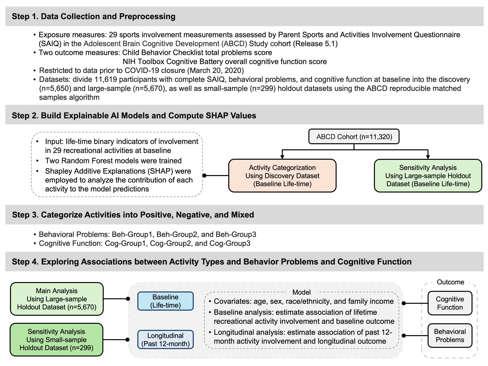

# Recreational Activities and Youth Behavioral & Cognitive Outcomes in the ABCD Study: an Explainable AI approach

  

This repository contains code and documentation for analyzing associations between recreational activities and behavioral/cognitive outcomes in youth using explainable AI methods.
